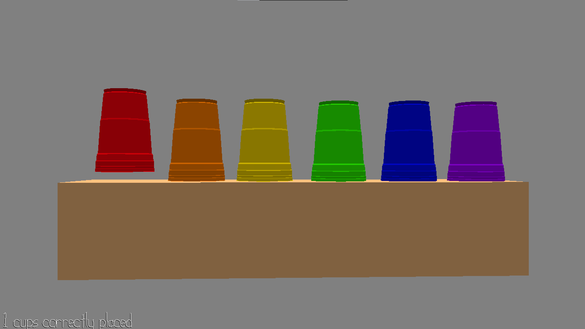

# Solo Cup Leveling

Author: Mandy Hu

Design: My game is a puzzle game where you have to figure out the correct order in which
        to place the solo cups. The only hint given is how many cups are in the correct
        space. Try to do it in as few moves as possible!

Screen Shot:

How To Play: 
Use w and d keys to switch over which cup you are hovering. Click space to select a cup.
Once you have selected two cups, press enter in order to swap them.
In the bottom left hand corner, text will let you know how many cups are currently in the
correct spot. Use this hint to sort the cups. Try to do it in as few moves as possible!

This game was built with [NEST](NEST.md).
